### Поиск

Search Everywhere. Двойное нажатие клавиши Shift вызывает popup окно для поиска чего угодно и где угодно. Достаточно написать фрагмент искомого текста, и наша пчелка трудяга найдет вхождения, причем сгруппирует их в категории. Фрагменты, найденные в классах, файлах, символах и даже элементах меню. Быстро и удобно, не правда ли?
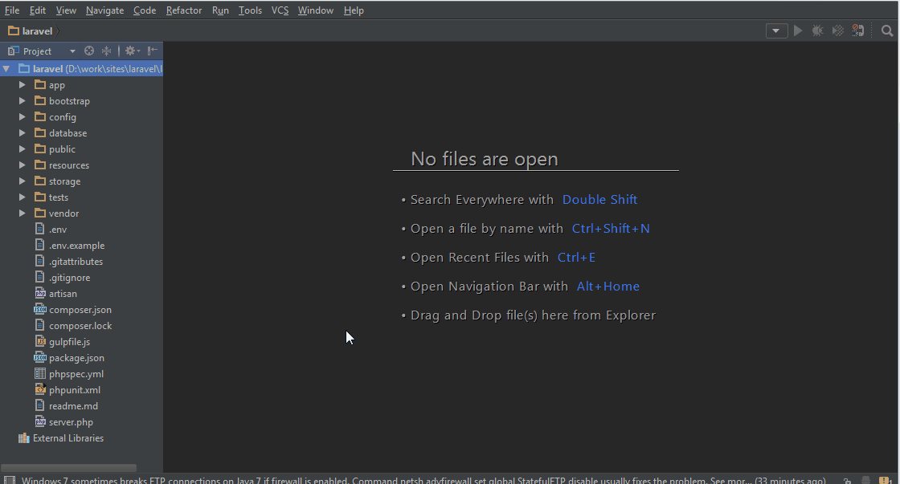

Поиск в окне. Находясь в окне со списком файлов проекта (Project), мы просто начинаем писать имя файла или папки, которое хотим найти. Найденные файлы и папки весьма недвусмысленно выделяются в списке. Клавишами вверх и вниз осуществляется навигация по результатам поиска.
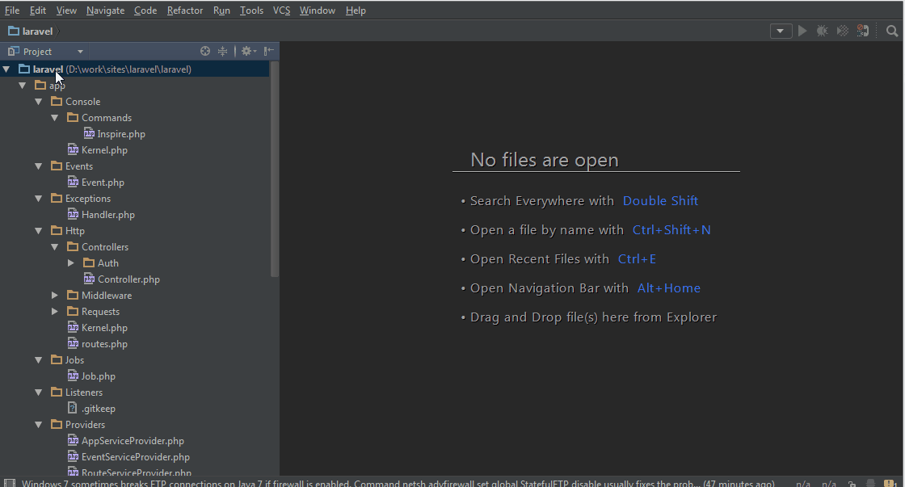

`[CTRL] + N` – Find by Class Name

Поиск по имени класса. Удобно в больших проектах, когда всё зарыто вглубь директорий или просто неизвестно где находится. Убойности добавляет «умный поиск», т.к. ищется как по части названия класса, так и по первым буквам, например SomeVeryLongClass будет найден по «SVLC». Учитывает регистр букв, будьте внимательны.
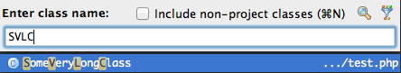

UPD: «Умный поиск» разработчики называют Camel's Hump. Кстати в настройках можно сделать чтобы выделение слов, а также перемещение осуществлялось не целиком (до пробела), а именно по по словам (до заглавной буквы)

`[CTRL] + [SHIFT] + N` – Find by File Name

Поиск по имени файла. Аналогично поиску по имени класса использует «умный поиск». 

UPD: Для нахождения файла по вложенности можно использовать слеш: some/deep/dir/with/file.txt найдется по «s/d/d/w/f»

`[CTRL] + [SHIFT] + [ALT] + N` – Find Symbol

Поиск любой функции/метода и констант, очень удобно, когда точно помнишь имя метода, а класс нет

`[ALT] + [F7]` – Find Usages

В момент когда курсор находится на имени класса или метода нажатие хоткея позволяет найти все использования в проекте или определенной части (Scope).

Есть вариант `[CTRL] + [ALT] + [F7]` — тот же поиск по использованиям, но в виде контекстного меню

`[CTRL] + [SHIFT] + F` – Find in Path

Поиск произвольной фразы по файлам проекта. При рефакторинге обычно хорошо дополняет Find Usages.

Не стоило бы писать о “просто поиске”, если бы не возможность ограничить директорию в котором будут искаться нужные штуки, или настроить Scope. Scope позволяет гибко настроить и сохранить область поиска, для использования в дальнейшем. Можно выкинуть из поиска, например, файлы фреймворка или сторонние либы.
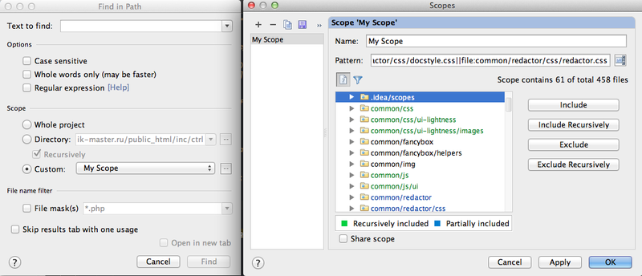


`[СTRL] + Пробел` (Basic) вызовет всплывающее окно с подсказками, если вы случайно закрыли его или оно какой-то причине не открылось:


Когда PhpStorm обнаруживает какие-либо проблемы, он подчеркнет проблемную область и вызывает всплывающую подсказку поверх него при наведении мыши или курсора клавиатуры в этой области. Нажав на неё или нажав Alt+Enter (Show Intention Actions) будет предложено решение. Это поведение можно изменить выключив отчеты об ошибках (я не рекомендую так делать):


Динамический шаблон для автодополнения параметров функций, методов и конструкторов. Он может быть вызван как с помощью ключевого слова params из списка автодоплнения, так и автоматически при вставке функции (необходимо включить отдельно в настройках: Settings → Editor → General → Smart Keys → Enable smart function parameters completion).
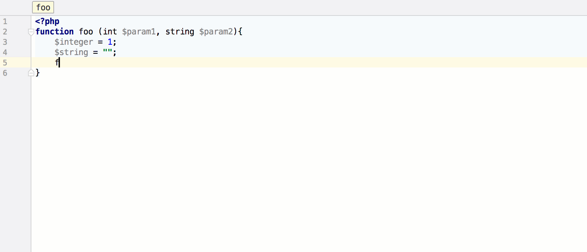


Умное автодополнение кода на основе типов (Smart Type Code Completion). Нажатие Ctrl + Shift + Space оставит в списке автодополнения только элементы, тип которых соответствует контексту. Тип контекста также учитывается при сортировке списка.
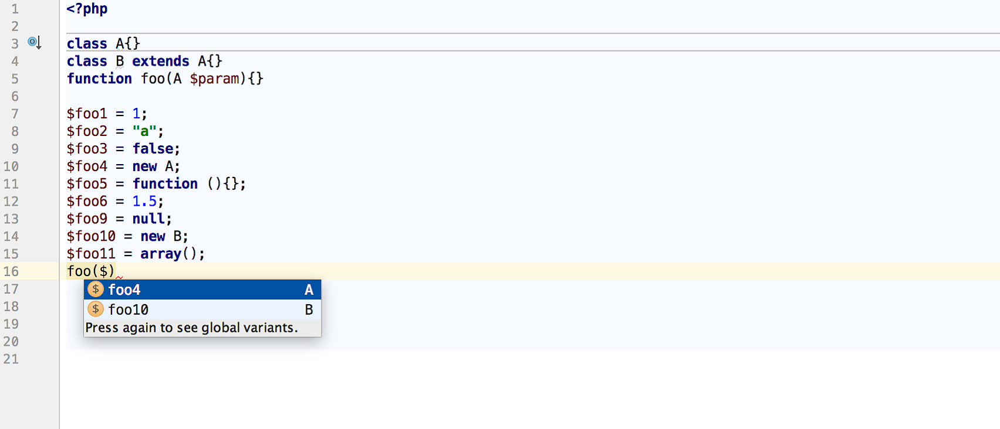


Поддержка Angular CLI и фрагментов кода (code snippets, они же live templates) для Angular 2.
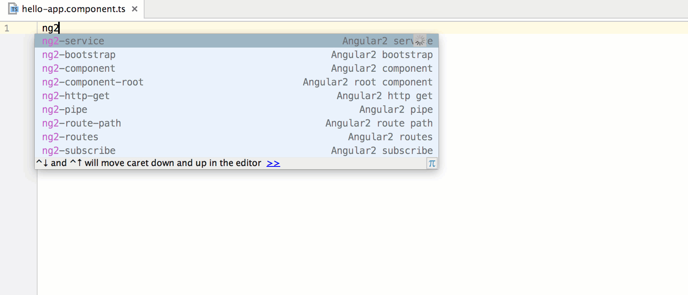


Изображения, JavaScript-файлы и CSS-файлы теперь можно перетащить мышкой в открытый HTML-файл, и соответствующий тег будет вставлен автоматически.
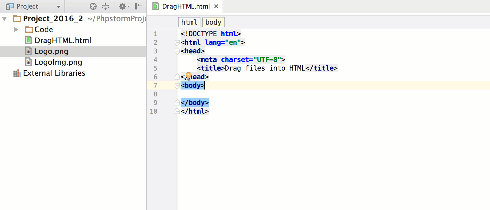

AngularJS
Для AngularJS 2 мы добавили много полезных шаблонов (live templates). В Project Wizard → Static Web появился раздел Angular CLI.
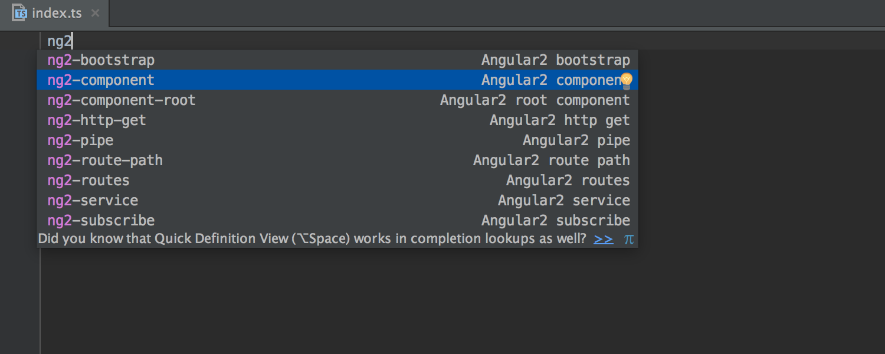


CTRL+ALT+L (Reformat Code), одна из моих самых используемых комбо, форматирует ваш код в соответствии с выбранными настройками оформления кода:

 
Нажав CTRL+SHIFT+Backspace (Last Edition Location), или кнопками мыши «Вперед» и «Назад» (если они у вас есть), вы перейдете к предыдущему месту редактирования. Это очень полезно при работе с большими файлами:


Удержание CTRL при наведении курсора на переменные или методы даст вам дополнительную информацию, а Ctrl+клик на переменной или методе, или нажатие CTRL+B (Declaration), когда курсор установлен на методе или на переменной приведет вас прямо туда, где он определен: 


CTRL+N (Class), и CTRL+SHIFT+N (File) позволит вам мгновенно перемещаться в любую часть какого-либо класса или файла проекта:


поиск является нечетким, а также поддерживает номера строк — вы можете использовать сокращения :XX, где ХХ — номер строки:


PhpStorm запоминает несколько последних значений буфера обмена — вы можете нажать CTRL+SHIFT+V (Paste from History), чтобы вызвать всплывающее окно, которое позволит вставить ранее использованное содержимое буфера обмена.

Если вы влюблены в способность Sublime производить поиск по командам самой IDE, то вы можете делать это и в PhpStorm — CTRL+SHIFT+A (Fine Action) вызовет всплывающее окно поиска команд. Забыли сокращение для переформотирования кода? Просто нажмите CTRL+SHIFT+A и наберите «Refor ..»:


https://emmet.io/

Можно сгенерировать HTML используя Emmet встроенный в PhpStorm. Просто введите div#myDiv>span.mySpanClass>ul>li*5 и нажмите TAB и получите:


https://docs.emmet.io/cheat-sheet/
Расширить эти возможности для любого языка можно добавив свои шаблоны в Settings -> Editor -> Live Templates. Подробное описани Emmet для CSS и HTML здесь.


Возможно несколько неинтуитивно, CTRL+W (Select Word at Caret) (который чаще всего используется для закрытия вкладки, так что вы можете переназначить его) будет выбирать блоки кода под курсором (слово, переменную, и т.д.). Повторение комбинации расширяет выбор, включая родительский узел, например:


Режим выбора колонки может быть вызван, удерживая среднюю кнопку мыши (колесико) и перетаскивая. Для меня это особенно полезно, когда нужно скопировать часть кода с глубоко отступом, но игнорируя ненужные пробелы:


Нажатие Alt+Home (Jump to Navigation Bar) позволит использовать курсоры для перемещения по цепочке переходов в верхней части. ESC выводит из этого режима:


CTRL+F12 (File Structure) вызовет всплывающее окно, которое позволит выбрать метод в текущем файле, к которому вы хотите перейти. Несмотря на то, что нет поле поиска, как только вы начнете печатать, выбор сузится до вариантов, которые вы ищите.


Консоль

Многие фреймворки используют консоль для быстрого выполнения частых действий. Для Symfony, Zend и других популярных фреймворков PHPStorm поддерживает подсказки и автодополнение консольных команд в Command Line Tools Console [CMD] + [SHIFT] + X

Но ничто не мешает сделать такое же и для своего проекта или частоупотребляемых команд UNIX или GIT, для этого нужно выбрать исполняемый файл и создать специальный XML файл вида:

```xml
<?xml version="1.0" encoding="UTF-8"?>
<framework xmlns:xsi="http://www.w3.org/2001/XMLSchema-instance" xsi:noNamespaceSchemaLocation="schemas/frameworkDescriptionVersion1.1.2.xsd" name="My Tools" invoke="/full/path/to/console.php" alias="c" enabled="true" version="2">
    <command>
        <name>command-name</name>
        <help>Описание команды. Не забываем про обработку спецсимволов!</help>
        <params>class</params>
    </command>
    <command>
        <name>another:command</name>
        <help>Описание команды с необязательным параметром</help>
        <params>class[=null]</params>
    </command>
</framework>
```
Подробное описание как это делается вот тут: devnet.jetbrains.net/docs/DOC-1230


В меню Help->Productivity Guide есть возможность посмотреть небольшую статистику про себя, а также список фич со статистикой их использования
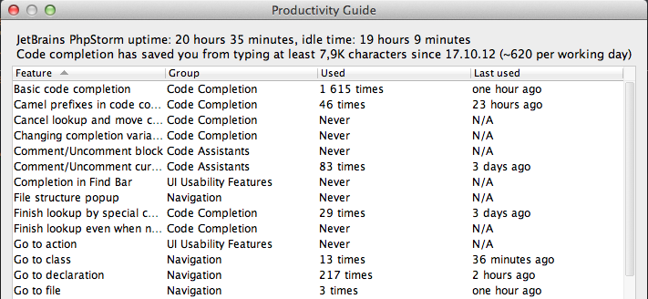


Метки в проекте

С помощью [CTRL] + [SHIFT] + 0...9 можно оставлять метки. Вернуться на метку можно с помощью [CTRL] + 0...9. Работает в контексте всего проекта. Спасибо ualinker


Навигация по инспекции кода. Справа от нашего кода, мы видим результат фоновой инспекции кода. IDE подсказывает нам об ошибках и неточностях в файле. Осуществлять навигацию между этими ошибками и замечаниями можно клавишей F2
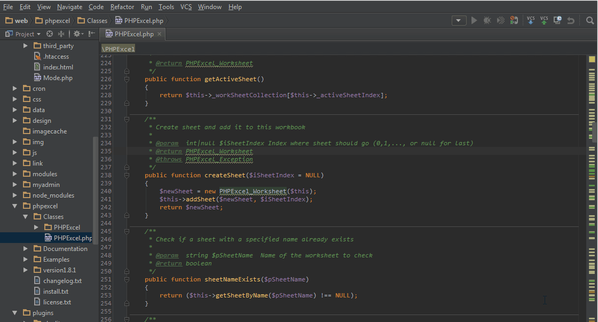


Последние открытые файлы. Ctrl+E открывает popup окно с файлами, которые мы недавно открывали. Так же в этом окне можно начать писать имя интересующего нас файла, и IDE отфильтрует список.
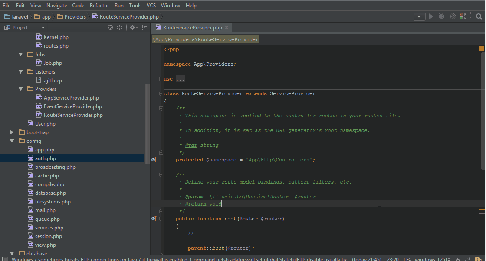

Генератор кода. Жмем в файле Alt+Insert. В появившемся popup окне IDE предлагает нам переопределить метод, реализовать метод, добавить конструктор, геттеры и сеттеры, а так же phpDoc коментарии
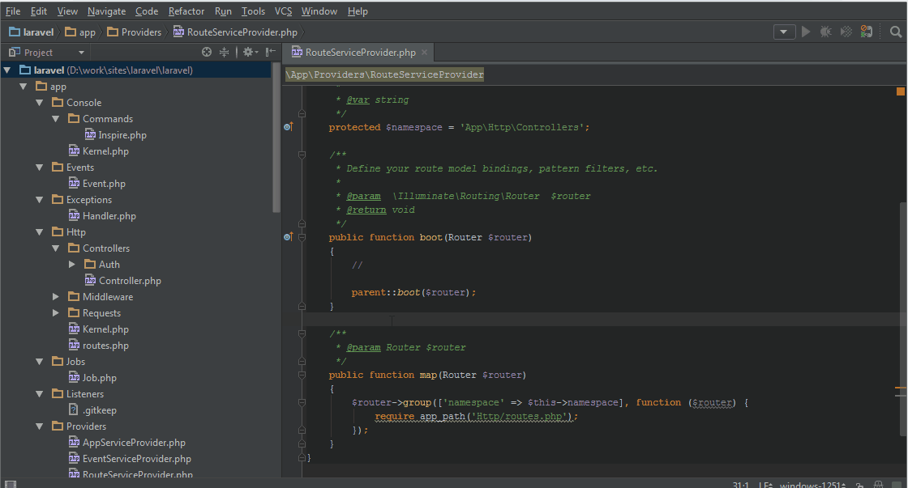

Postfix Completion. Удобный инструмент, который появился в 9 версии IDE. Позволяет быстро писать конструкции типа if, if not и т.д.
Перед вставкой авто дополнения набираем точку и IDE откроет popup окно с выбором для завершения вставки.
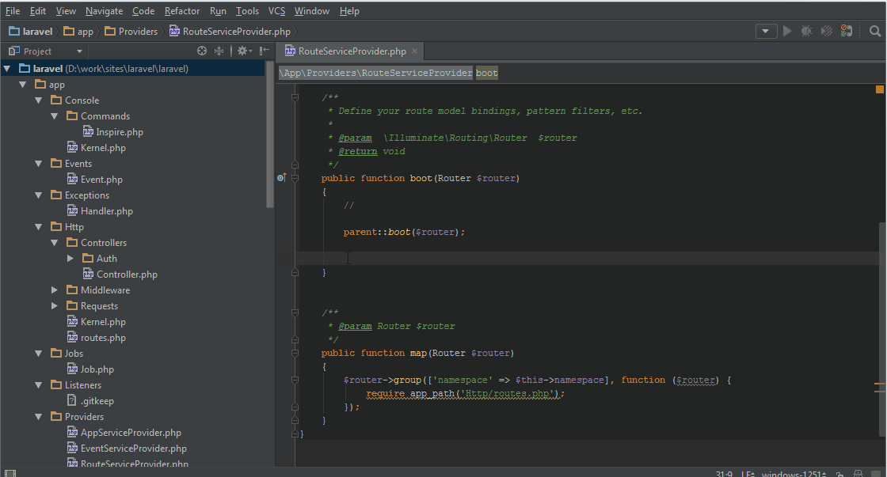
[Postfix Code Completion](https://blog.jetbrains.com/idea/2014/03/postfix-completion/#sthash.mI1AHa17.dpuf)

- [!]           `(!expr)`
- [else]        `(if (!expr))`
- [echo]        `(echo expr;)`
- [fe]          `(foreach($it as expr))`
- [if]          `(if (expr))`
- [isset]       `(if (isset(expr)))`
- [nn]          `(if (expr !== null))`
- [null]        `(if (expr === null))`
- [par]         `((expr))`
- [return]      `(return expr)`
- [throw]       `(throw expr)`
- [var_dump]    `(var_dump(expr))`

Productivity Guide. Данный раздел покажет вашу статистику использования различных “Фич”.Все данные представлены в виде таблицы с колонками: Feature – название, Group – категория, Used – какое количество времени вы ей пользовались, Last used – когда последний раз использовали. Табличку со статистикой можно отсортировать по каждой колонке. Этот раздел так же примечателен описанием различных возможностей, в котором указаны горячие клавиши для вызова.
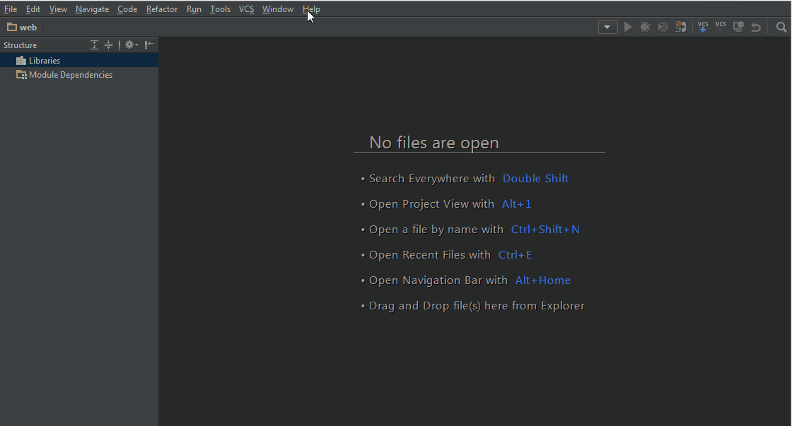